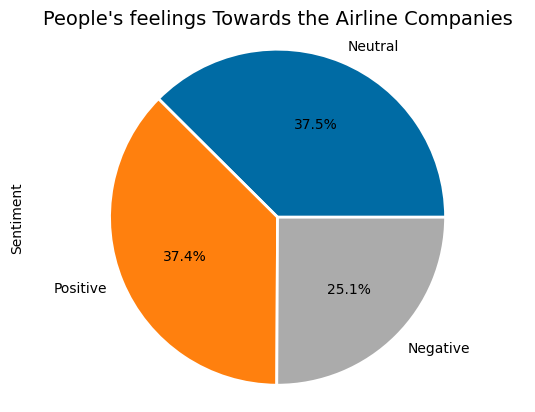
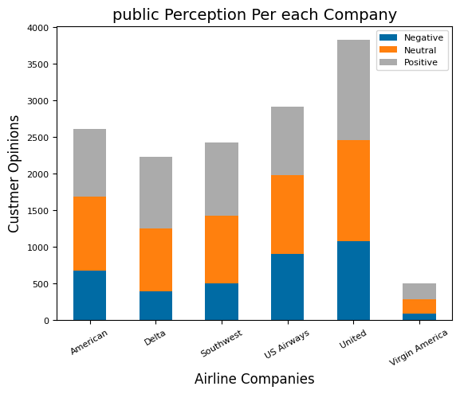
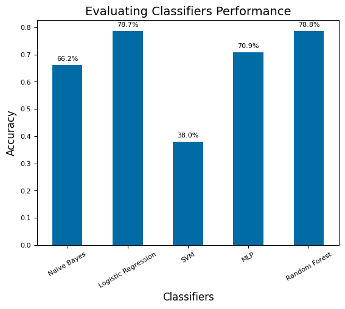

# Inshirah Idris_Portfolio
Assistant Professor

# [Project 1: Airline-Tweet-Sentiment-Analysis](https://github.com/inshirah-idris/Airline-Tweet-Sentiment-Analysis)
A comprehensive analysis of public airline sentiment based on the 'Twitter US Airline Sentiment' dataset that is available in Kaggle. The project involves four main stages: tweet preprocessing, sentiment labeling, feature extraction, and sentiment classification.

 

# [Project 2: Twitter Sentiment Analysis: Arabic Language](https://github.com/inshirah15/Memeory-Aid)
The project was divided into four main phases:

* Preprocessing
* Labeling
* Feature Extraction
* Classification

