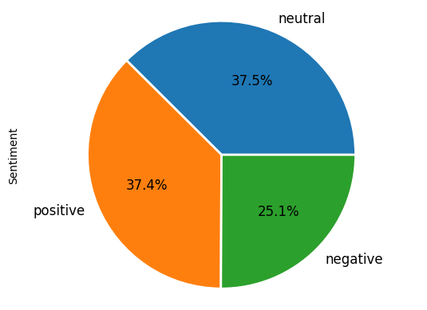

# Inshirah_Portfolio
Assistant Professor

# [Project 1: Twitter Sentiment Analysis: English Language](https://github.com/inshirah15/Memeory-Aid)
The project was divided into four main phases:

* Preprocessing
* Labeling
* Feature Extraction
* Classification

(https://github.com/inshirah15/Inshirah_Portfolio/blob/main/images/W.png)

[https://github.com/inshirah15/Inshirah_Portfolio/blob/main/images/N.png]

# [Project 2: Twitter Sentiment Analysis: Arabic Language](https://github.com/inshirah15/Memeory-Aid)
The project was divided into four main phases:

* Preprocessing
* Labeling
* Feature Extraction
* Classification

